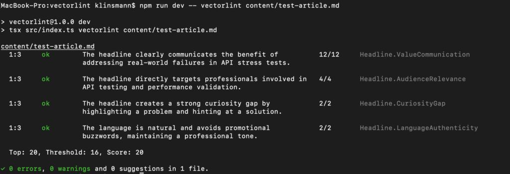

# VectorLint
A command-line tool that evaluates Markdown content using LLMs and provides quality scores. Think of it like [Vale](https://github.com/errata-ai/vale), but instead of pattern matching, it uses LLMs to catch subjective issues like clarity, tone, and technical accuracy.



## Features

- **LLM-based** - Uses LLMs to check content quality
- **CLI Support** - Run locally or in CI/CD pipelines
- **Consistent Evaluations** - Write structured evaluation prompts to get consistent evaluation results
- **Quality Scores & Thresholds** - Set scores and thresholds for your quality standards

## Installation

Install dependencies:

```bash
npm install
```

### Project Config (vectorlint.ini)

Copy the sample and edit for your project:

```bash
cp vectorlint.example.ini vectorlint.ini
```

Keys (PascalCase):
- `PromptsPath`: directory containing your `.md` prompts
- `ScanPaths`: bracketed list of file patterns to scan (supports only `.md` and `.txt`)

Example (vectorlint.example.ini):

```
PromptsPath=prompts
ScanPaths=[*.md]
Concurrency=4
```

Note: `vectorlint.ini` is git-ignored; commit `vectorlint.example.ini` as the template.

### Prompts

Prompts are markdown files. VectorLint loads all `.md` files from `PromptsPath` and runs each one against your content. The result is an aggregated report with one section per prompt.

- Prompts do not need a placeholder; the file content is injected automatically as a separate message
- Prompts start with a YAML frontmatter block that defines the evaluation criteria (names, weights, and optional thresholds/severities). Keep the body human‑readable
- VectorLint enforces a structured JSON response via the API and parses scores automatically - you don't need to specify output format in your prompts

## Usage

### Local Development

Run VectorLint without building:

```bash
# Basic usage
npm run dev -- path/to/article.md

# See what's being sent to the LLM
npm run dev -- --verbose path/to/article.md

# Debug mode: show prompt and full JSON response
npm run dev -- --verbose --show-prompt --debug-json path/to/article.md
```

Or make the script executable:

```bash
chmod +x src/index.ts
./src/index.ts path/to/article.md
```

## Prompt Mapping (INI)

Control which prompts apply to which files using INI sections. Precedence: `Prompt:<Id>` → `Directory:<Alias>` → `Defaults`. Excludes are unioned and win over includes.

Example:

```
[Prompts]
paths = ["Default:prompts", "Blog:prompts/blog"]

[Defaults]
include = ["**/*.md"]
exclude = ["archived/**"]

[Directory:Blog]
include = ["content/blog/**/*.md"]
exclude = ["content/blog/drafts/**"]

[Prompt:Headline]
include = ["content/blog/**/*.md"]
exclude = ["content/blog/drafts/**"]
```

Notes:
- Aliases in `[Prompts].paths` tie a prompt's folder to a logical name
- The CLI derives a prompt's alias from its actual file path and applies the mapping per scanned file

## Testing

- Run in watch mode (local dev): `npm test`
- Single run (no watch): `npm run test:run`
- CI with coverage: `npm run test:ci`

Tests live under `tests/` and use Vitest. They validate config parsing (PromptsPath, ScanPaths), file discovery (including prompts exclusion), prompt/file mapping, and prompt aggregation with a mocked provider.