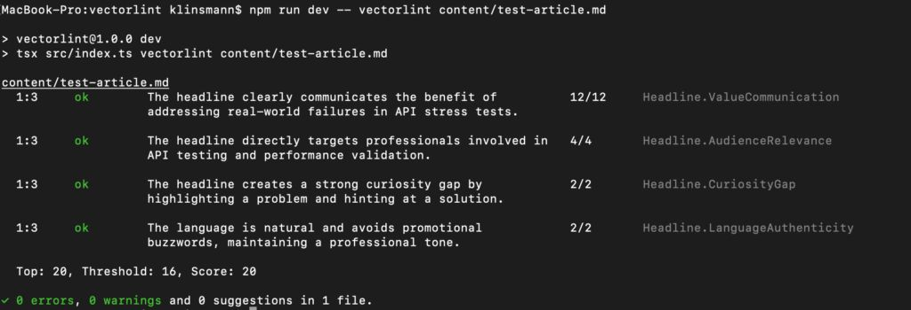

# VectorLint: Prompt it, Lint it! [](https://www.npmjs.com/package/vectorlint) [](https://opensource.org/licenses/Apache-2.0)

VectorLint is a command-line tool that evaluates and scores content using LLMs. It uses [LLM-as-a-Judge](https://en.wikipedia.org/wiki/LLM-as-a-Judge) to catch terminology, technical accuracy, and style issues that require contextual understanding.



## Installation

### Option 1: Global Installation

Install globally from npm:

```bash
npm install -g vectorlint
```

Verify installation:

```bash
vectorlint --help
```

### Option 2: Zero-Install with npx

Run VectorLint without installing:

```bash
npx vectorlint path/to/article.md
```

## Enforce Your Style Guide

Define rules as Markdown files with YAML frontmatter to enforce your specific content standards:

- **Check SEO Optimization** - Verify content follows SEO best practices
- **Detect AI-Generated Content** - Identify artificial writing patterns
- **Verify Technical Accuracy** - Catch outdated or incorrect technical information
- **Ensure Tone & Voice Consistency** - Match content to appropriate tone for your audience

If you can write a prompt for it, you can lint it with VectorLint.

👉 **[Learn how to create custom rules →](./CREATING_RULES.md)**

## Quality Scores

VectorLint scores your content using error density and a rubric-based system, enabling you to measure quality across documentation. This gives your team a shared understanding of which content needs attention and helps track improvements over time.

- **Density-Based Scoring:** For errors that can be counted, scores are calculated based on **error density (errors per 100 words)**, making quality assessment fair across documents of any length.
- **Rubric-Based Scoring:** For more nuanced quality standards, like flow and completeness, scores are graded on a 1-4 rubric system and then normalized to a **1-10 scale**.

## Quick Start

### 1. Zero-Config Mode (Fastest)

If you just want to check your content against a style guide:

```bash
vectorlint init --quick
```

This creates a `VECTORLINT.md` file where you can paste your style guide.

> **Note:** You must set up your credentials in `~/.vectorlint/config.toml` (see Step 3) before running checks.

Then run:

```bash
vectorlint doc.md
```

### 2. Full Configuration

For more power (custom rule packs, specific targets), run:

```bash
vectorlint init
```

This creates:
- **VectorLint Config** (`.vectorlint.ini`): Project-specific settings.
- **App Config** (`~/.vectorlint/config.toml`): LLM provider API keys.

👉 **[Full configuration reference →](./CONFIGURATION.md)**

### 3. Configure API Keys

Open your global **App Config** (`~/.vectorlint/config.toml`) and uncomment the section for your preferred LLM provider (OpenAI, Anthropic, Gemini, or Azure).

    ```toml
    [env]
    LLM_PROVIDER = "openai"
    OPENAI_API_KEY = "sk-..."
    ```

    *Note: You can also use a local `.env` file in your project, which takes precedence over the global config.*

**Run a check:**

```bash
vectorlint doc.md
```

VectorLint is bundled with a `VectorLint` preset containing rules for AI pattern detection, directness, and more. The `init` command configures this automatically.

👉 **[Learn how to create custom rules →](./CREATING_RULES.md)**

## Contributing

We welcome your contributions! Whether it's adding new rules, fixing bugs, or improving documentation, please check out our [Contributing Guidelines](.github/CONTRIBUTING.md) to get started.

## Resources

- **[Creating Custom Rules](./CREATING_RULES.md)** - Write your own quality checks in Markdown
- **[Configuration Guide](./CONFIGURATION.md)** - Complete reference for `.vectorlint.ini`
